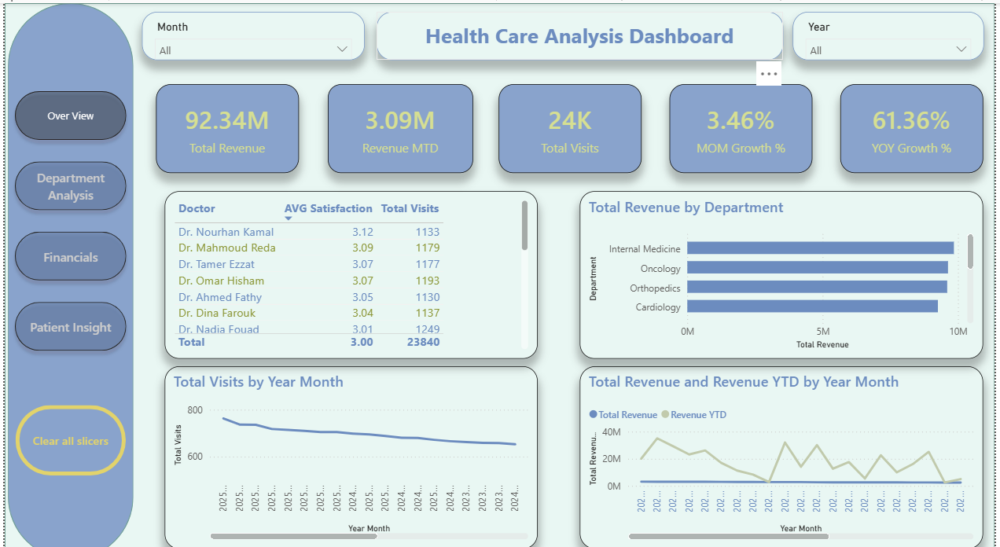
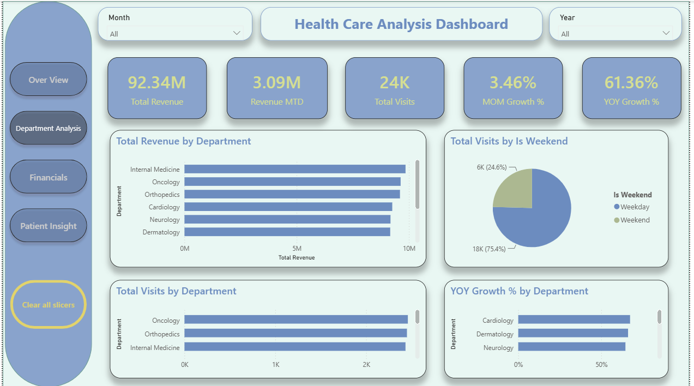
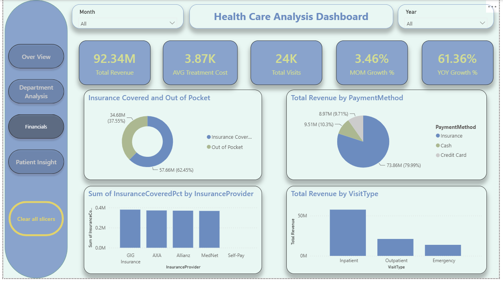
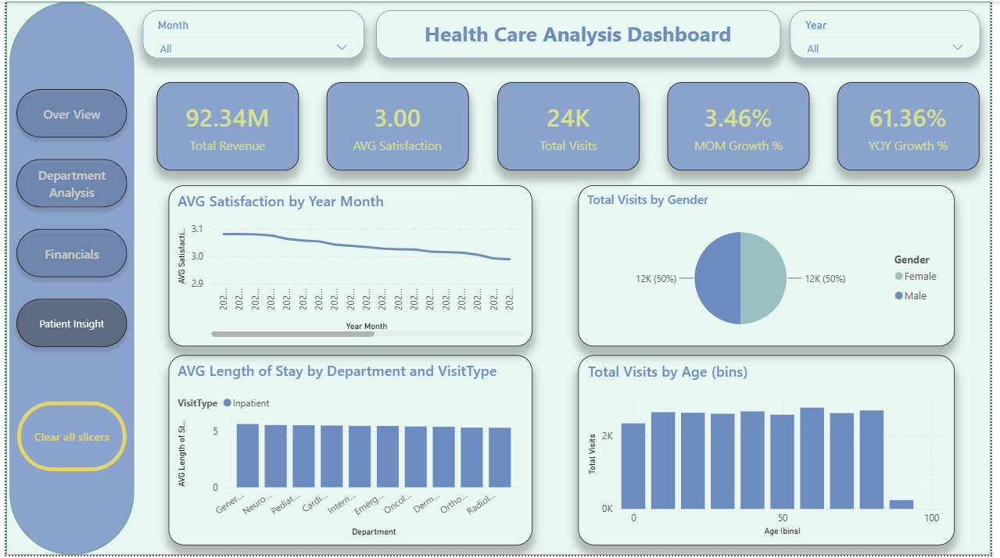

# Healthcare Analysis Dashboard

## Overview

This project is a Healthcare Analysis Dashboard developed using Microsoft Power BI.

The main goal of the project is to analyze healthcare visits, revenue, patient satisfaction, treatment costs, departments, doctors, insurance, and other healthcare-related metrics.

## Dashboard Pages

### 1. Overview
Provides an overall view of:
- Total Revenue
- Total Visits
- MTD Revenue
- MOM Growth
- YOY Growth
- Revenue and Visits trends

### 2. Department Analysis
Analyzes:
- Revenue by Department
- Visits by Department
- YOY Visit Growth
- Seasonal Visit Patterns
- Weekday vs Weekend Visits

### 3. Financials
Includes:
- Revenue by Visit Type
- Average Treatment Cost
- Insurance Covered vs Out of Pocket
- Revenue by Payment Method
- Revenue by Insurance Provider

### 4. Patient Insights
Analyzes:
- Average Satisfaction
- Satisfaction Trend
- Length of Stay
- Patient Gender
- Patient Age
- Doctor Visits and Satisfaction

## Tools & Technologies

- Microsoft Power BI
- DAX
- Data Analysis
- Data Visualization
- Time Intelligence

## Key DAX Concepts

The project includes:
- MTD
- YTD
- MOM Growth
- YOY Growth
- SPLY
- Cumulative Totals
- Average Measures

## Author

Mostafa Ahmed
